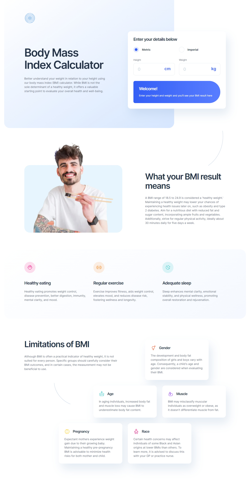

# Frontend Mentor - Body Mass Index Calculator solution

This is a solution to the [Body Mass Index Calculator challenge on Frontend Mentor](https://www.frontendmentor.io/challenges/body-mass-index-calculator-brrBkfSz1T). Frontend Mentor challenges help you improve your coding skills by building realistic projects. 

## Table of contents

- [Overview](#overview)
  - [The challenge](#the-challenge)
  - [Screenshot](#screenshot)
  - [Links](#links)
- [My process](#my-process)
  - [Useful resources](#useful-resources)
- [Author](#author)

## Overview

### The challenge

Users should be able to:

- Select whether they want to use metric or imperial units
- Enter their height and weight
- See their BMI result, with their weight classification and healthy weight range
- View the optimal layout for the interface depending on their device's screen size
- See hover and focus states for all interactive elements on the page

### Screenshot

### Links

- Solution URL: [todo](https://your-solution-url.com)
- Live Site URL: [todo](https://your-live-site-url.com)

### Useful resources

- [StackOverflow](https://stackoverflow.com/questions/9004307/two-input-fields-inside-one-label) - When I saw the design files, it looked like the fields for the imperial units were wrapped in one label, but I didn't know if it was right to use one label for two fields. The accepted answer cleared that to me. 
- [w3schools Accessibility Labels](https://www.w3schools.com/accessibility/accessibility_labels.php) - This w3schools page is very good to understand labels and legends.
- [MDN docs - input type="number"](https://developer.mozilla.org/en-US/docs/Web/HTML/Element/input/number#accessibility_concerns) - I was going to set the inputs type to number, but since I didn't want the role to be "spinbutton", I followed the MDN docs and replaced it with type="text" and inputmode="numeric".

## Author

- Frontend Mentor - [@jumiranda5](https://www.frontendmentor.io/profile/jumiranda5)
